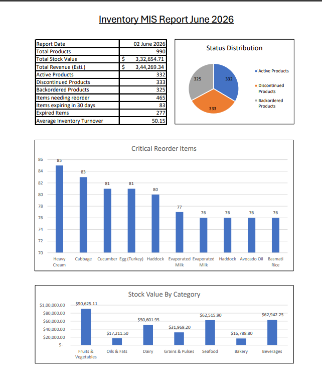
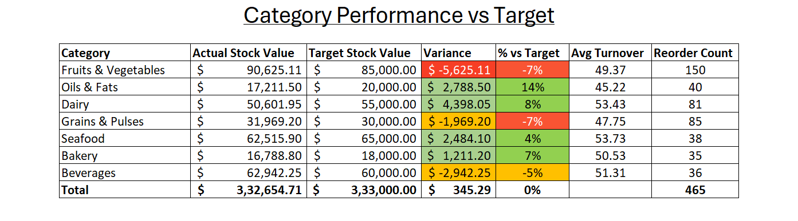

# Inventory MIS Report - Excel

## Overview
This project is a complete Inventory MIS (Management Information System) Report 
built in Microsoft Excel on a real-world style dataset of 990 products across 
multiple categories, suppliers, and warehouse locations.

The goal was to simulate what an MIS executive does on the job, cleaning raw data, 
building calculated columns, creating summary KPIs, flagging operational issues, 
and delivering a clean one-page report to management.

---

## Dataset
- 990 rows of inventory data
- Columns: Product_Name, Category, Supplier_Name, Warehouse_Location, Status, 
  Product_ID, Supplier_ID, Date Received, Last_Order_Date, Expiration_Date, 
  StockQuantity, Reorder_Level, Reorder_Quantity, Unit_Price, Sales_Volume, 
  Inventory_Turnover

---

## File Structure

| Sheet | Description |
|---|---|
| Raw Data | Original untouched source data |
| Working Data | Cleaned data with all calculated columns added |
| Category Analysis | Category-wise breakdown of stock, revenue, and reorder counts |
| Supplier Analysis | Supplier performance with reliability scoring |
| Stock Alerts | Filtered list of items needing immediate reorder, sorted by urgency |
| MIS Report | Final one-page management report with KPIs and charts |

---

## Key Features
- **KPI Summary** : Total Stock Value, Revenue, Active/Discontinued/Backordered counts, Expiry tracking
- **Calculated Columns** : Stock Value, Revenue, Reorder Flag, Expiry Status, Days Since Last Order
- **Supplier Reliability Score** : rates each supplier based on proportion of problem products
- **Stock Alerts** : items below reorder level ranked by urgency with estimated reorder cost
- **Charts** : Status Distribution, Stock Value by Category, Top 10 Critical Reorder Items

---

## Excel Skills Used
COUNTIF, COUNTIFS, SUMPRODUCT, AVERAGEIF, nested IF, TODAY(), ROUND, 
Pivot Tables, Conditional Formatting, Custom Date Formatting

---

## Tools
Microsoft Excel (formulas, Conditional Formating and Pivot Tables)
